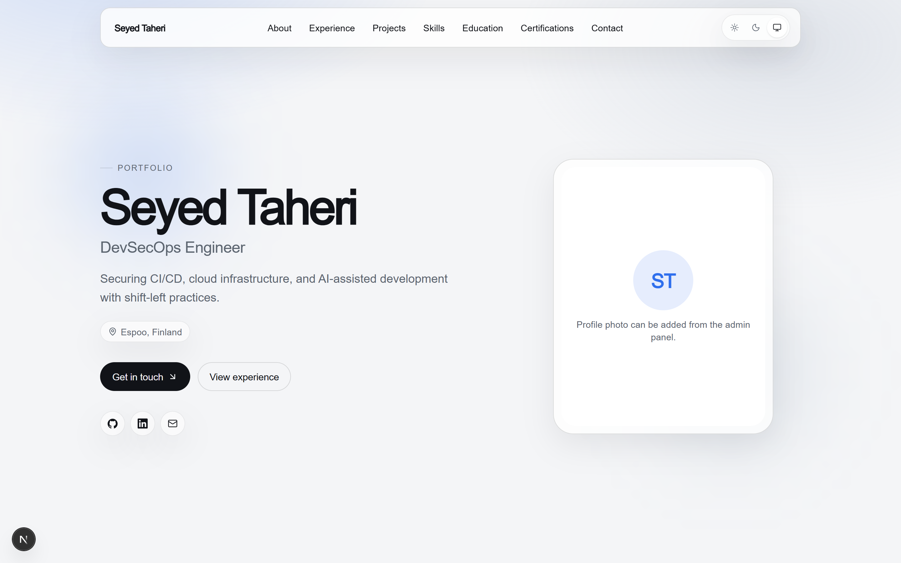
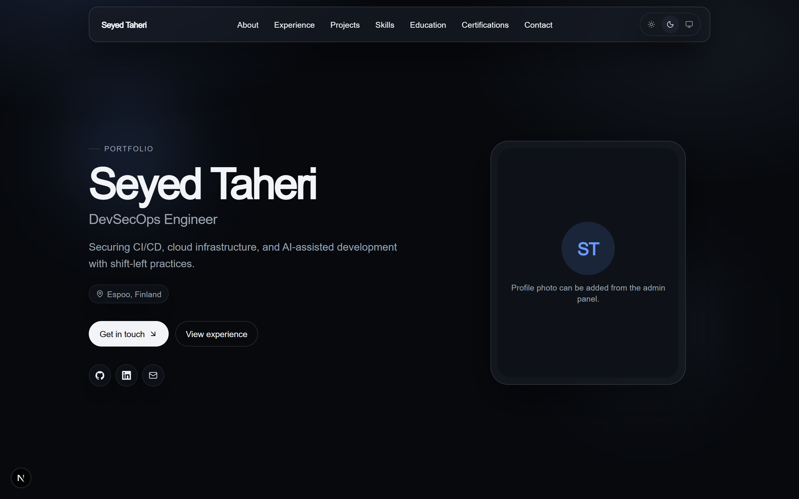
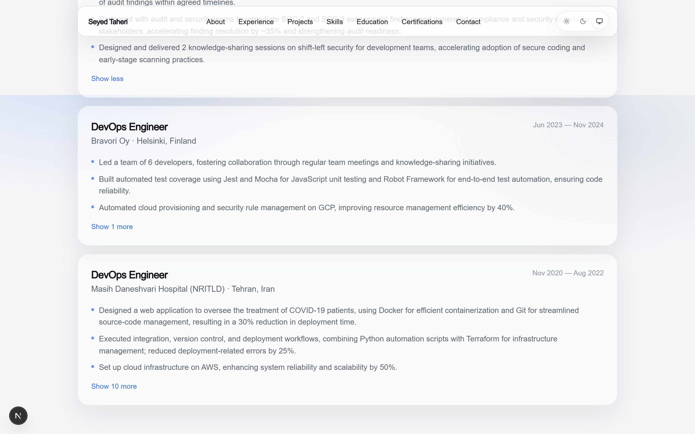
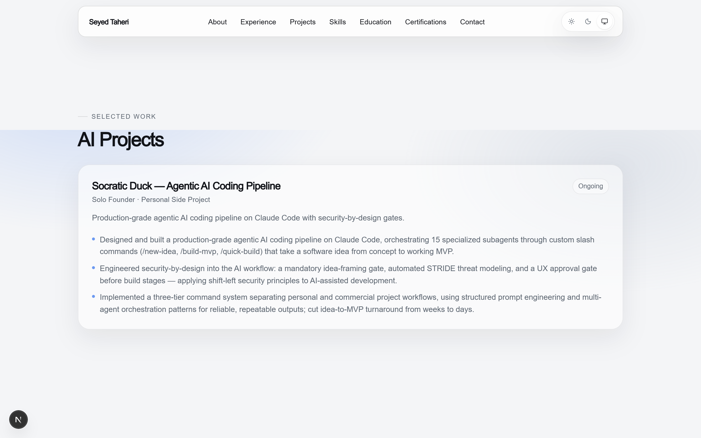
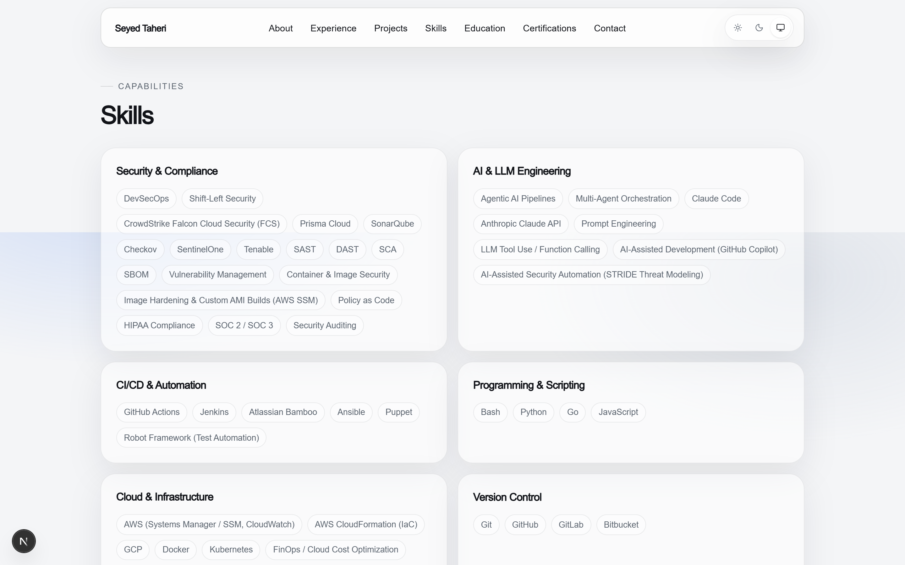
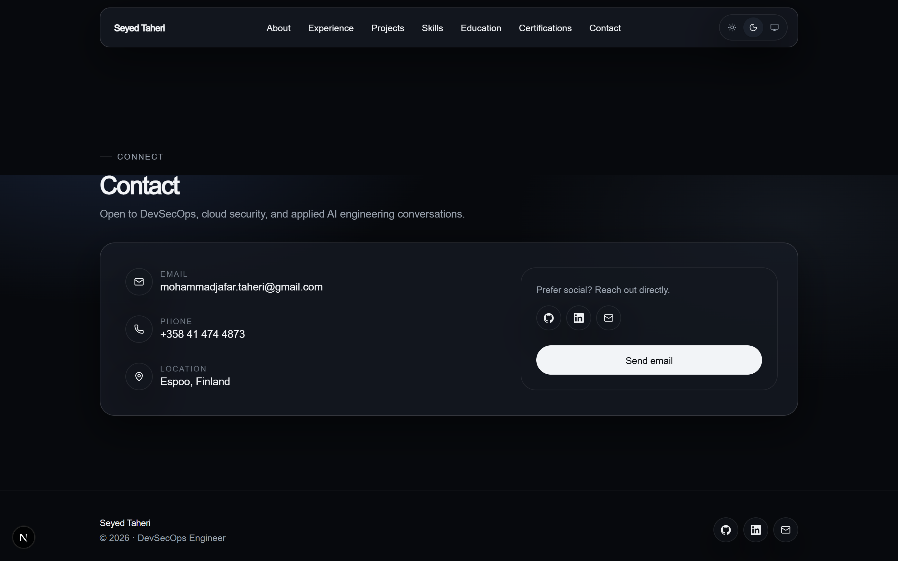
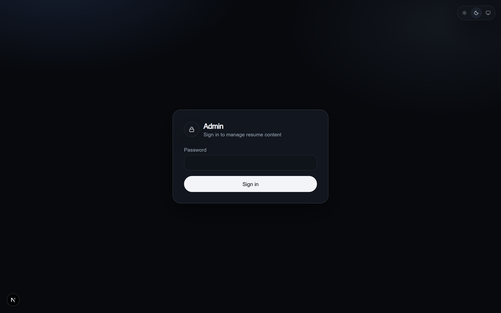
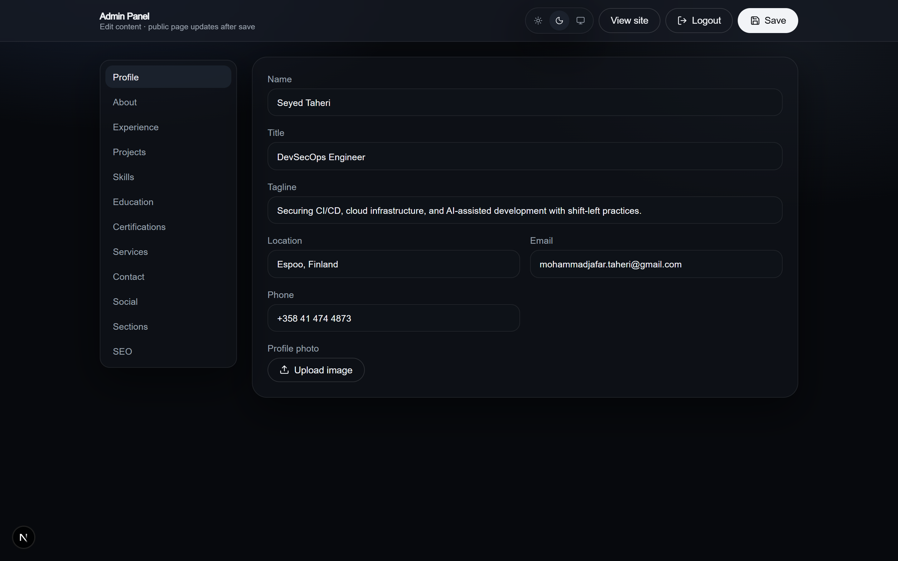

# Seyed Taheri — Portfolio

Case study · premium DevSecOps resume site with a secure content admin.



---

## Brief

Single-page portfolio for a DevSecOps engineer: glass UI, light/dark themes, motion reveals, SEO, and an authenticated admin panel that edits live resume content (Upstash Redis).

---

## Product tour

### Hero

Identity, tagline, location, CTAs, and social links — light and dark.

| Light | Dark |
| --- | --- |
|  |  |

### Experience

Timeline of roles with measurable outcomes.



### Projects

Selected AI / engineering work in card layout.



### Skills

Capability clusters as tagged glass cards.



### Contact

Reach-out section in dark theme.



### Admin

Password-gated CMS for profile, sections, social, and SEO.

| Login | Editor |
| --- | --- |
|  |  |

---

## Stack

| Layer | Choice |
| --- | --- |
| Framework | Next.js App Router · TypeScript |
| UI | Tailwind CSS v4 · Motion |
| Theme | `next-themes` (light / dark / system) |
| Content | Seed resume + Upstash Redis |
| Auth | Cookie session · `/admin` |

---

## Run

```bash
npm install
cp .env.example .env.local
npm run dev
```

- Site: [http://localhost:3000](http://localhost:3000)
- Admin: [http://localhost:3000/admin](http://localhost:3000/admin) — local fallback password `admin` when `ADMIN_PASSWORD` is unset
- Without Redis env vars, seed content from `src/data/default-resume.ts` is served; saves need Redis

### Vercel

Set `ADMIN_PASSWORD`, `ADMIN_SESSION_SECRET`, `UPSTASH_REDIS_REST_URL`, `UPSTASH_REDIS_REST_TOKEN`.
